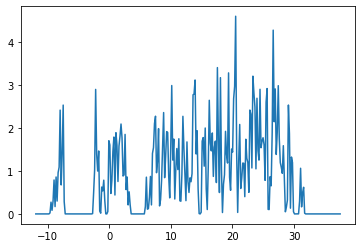
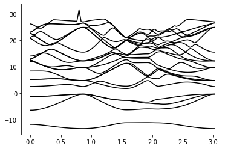

# pivotpy
> Python Processing Tool for Vasp Input/Output.


This file will become your README and also the index of your documentation.

## Install

`pip install pivotpy`

## How to use

```python
from pivotpy import vr_parser as pp
xml_data=pp.read_asxml(path='../vasprun.xml')
vr=pp.export_vasprun(xml_data=xml_data)
```

```python
vr.keys()
```


    dict_keys(['sys_info', 'dim_info', 'kpoints', 'kpath', 'bands', 'tdos', 'pro_bands', 'pro_dos', 'poscar', 'xml'])


```python
pp.exclude_kpts(xml_data=xml_data)
```


    {'skipk': 10}


```python
pp.get_summary(xml_data=xml_data)
```


    {'SYSTEM': 'AlAs',
     'NION': 2,
     'TypeION': 2,
     'ElemName': ['Al', 'As'],
     'ElemIndex': [0, 1, 2],
     'ISPIN': 1}


```python
import matplotlib.pyplot as plt
import numpy as np
en=vr.tdos.tdos[:,0]
dos=vr.tdos.tdos[:,1]
dplot=plt.plot(en,dos)
```





```python
k=vr.kpath
ef=vr.bands.E_Fermi
evals=vr.bands.evals-ef
plot=plt.plot(k,evals,'k')
```




