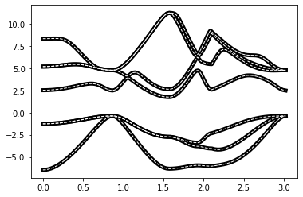

# pivotpy
> Python Processing Tool for Vasp Input/Output.


This file will become your README and also the index of your documentation.

## Install

`pip install pivotpy`

## How to use

```
from pivotpy import vr_parser as vp
xml_data=vp.read_asxml(path='../vasprun.xml')
vr=vp.export_vasprun(xml_data=xml_data,elim=[-5,5])
vr.keys()
```


    dict_keys(['sys_info', 'dim_info', 'kpoints', 'kpath', 'bands', 'tdos', 'pro_bands', 'pro_dos', 'poscar', 'xml'])


```
print(vp.exclude_kpts(xml_data=xml_data).skipk)
vp.get_summary(xml_data=xml_data)
```

    10
    


    {'SYSTEM': 'AlAs',
     'NION': 2,
     'TypeION': 2,
     'ElemName': ['Al', 'As'],
     'ElemIndex': [0, 1, 2],
     'ISPIN': 1}


```
import matplotlib.pyplot as plt
import numpy as np
en=vr.tdos.dos[:,0]
dos=vr.tdos.dos[:,1]
dplot=plt.plot(en,dos)
```


```
from pivotpy import g_utils as gu
k=vr.kpath
ef=vr.bands.E_Fermi
evals=vr.bands.evals-ef
#Let's interpolate our graph to see effect. It is useful for colored graphs.
knew,enew=gu.interpolate_data(x=k,y=evals,n=10,k=3)
plot=plt.plot(k,evals,'k',lw=5,label='real data')
plot=plt.plot(k,evals,'w',lw=1,label='interpolated',ls='dashed')
```





### Running powershell commands from python.
Some tasks are very tideious in python while just a click way in powershell. See below, and try to list processes in python yourself to see the difference!

```
gu.ps_to_std(ps_command='(Get-Process)[0..4]')
```

    Handles  NPM(K)    PM(K)      WS(K)     CPU(s)     Id  SI ProcessName
    -------  ------    -----      -----     ------     --  -- -----------
    563      49    39564      75820      17.41  16184   1 AltC
    271      17     6072      24916       1.67   6776   1 ApplicationFrameHost
    147       9     1360       5832              5320   0 armsvc
    413      22   300208      39312       7.42   3556   0 audiodg
    331      17     4724       6628       2.38  14560   1 CastSrv
    
